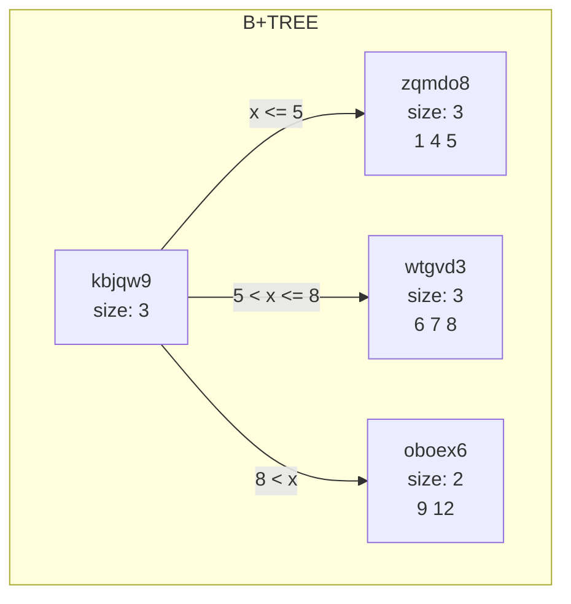
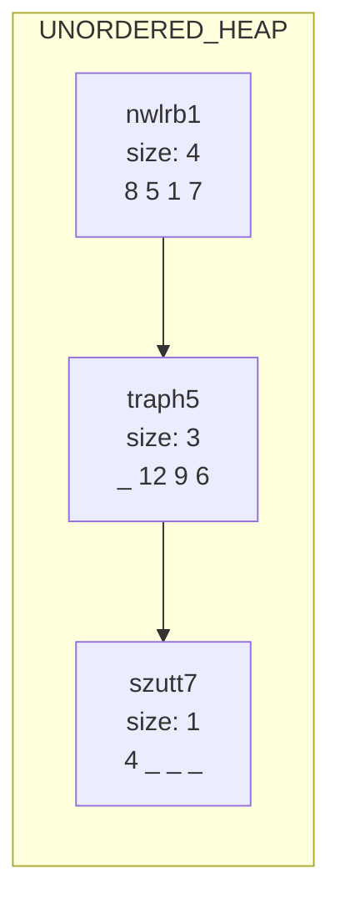

```mermaid
graph TD
subgraph B+TREE
kbjqw9[kbjqw9<br/>size: 3<br/>]
zqmdo8[zqmdo8<br/>size: 3<br/>1 4 5 ]
kbjqw9-->|x <= 5|zqmdo8
wtgvd3[wtgvd3<br/>size: 3<br/>6 7 8 ]
kbjqw9-->|5 < x <= 8|wtgvd3
oboex6[oboex6<br/>size: 2<br/>9 12 ]
kbjqw9-->|8 < x|oboex6
end
```

```mermaid
graph LR
subgraph UNORDERED_HEAP
nwlrb1[nwlrb1<br/>size: 4<br/>8 5 1 7 ]
traph5[traph5<br/>size: 3<br/>_ 12 9 6 ]
nwlrb1-->traph5
szutt7[szutt7<br/>size: 1<br/>4 _ _ _ ]
traph5-->szutt7
end
```
